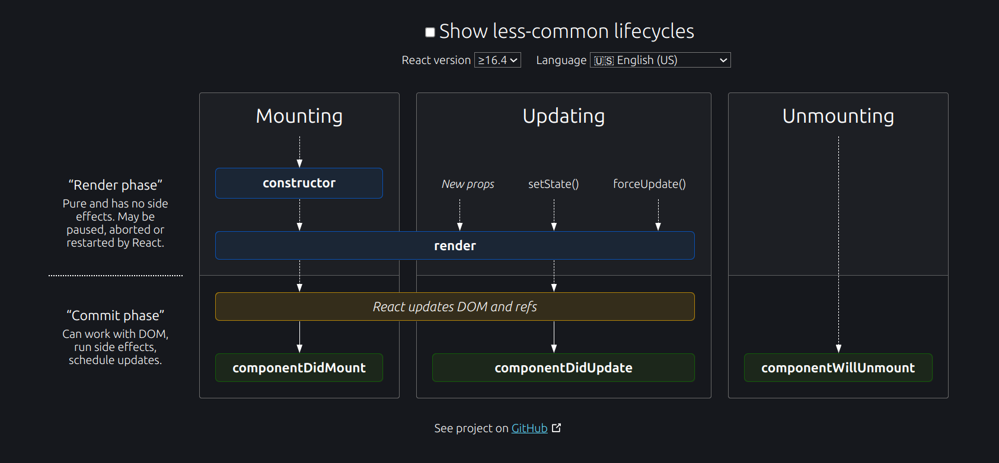

## adding routing

docs: https://reactrouter.com/start/library/routing


### check url
- http://localhost:5173/
- http://localhost:5173/about

add this to work on link

``` jsx
import { NavLink, Link } from "react-router";

function Header() {
  return (
    <nav>
      {/* NavLink makes it easy to show active states */}
      <NavLink
        to="/"
        className={({ isActive }) =>
          isActive ? "active" : ""
        }
      >
        Home
      </NavLink>

      <Link to="/concerts/salt-lake-city">Concerts</Link>
    </nav>
  );
}

```

### how to make network slow?

> by default network -> no throttling

inspect -> network (tab) -> click on throttling -> select slow 4g


### Methods in react lifecycle

- **componentDidMount**

The `componentDidMount()` method is called after the component is rendered.

This is where you run statements that requires that the component is already placed in the DOM.

- **componentDidUpdate**

The `componentDidUpdate` method is called after the component is updated in the DOM.

The example below might seem complicated, but all it does is this:

When the component is mounting it is rendered with the favorite color "red".

When the component has been mounted, a timer changes the state, and the color becomes "yellow".

This action triggers the update phase, and since this component has a componentDidUpdate method, this method is executed and writes a message in the empty DIV element:

- **Unmounting**

The next phase in the lifecycle is when a component is removed from the DOM, or unmounting as React likes to call it.

React has only one built-in method that gets called when a component is unmounted:

> **componentWillUnmount()**

examples: 

https://www.w3schools.com/react/react_lifecycle.asp

https://www.freecodecamp.org/news/react-component-lifecycle-methods/

diagrams:

offline: 



online: https://projects.wojtekmaj.pl/react-lifecycle-methods-diagram/

## How ot access VITE OR REACT API KEYS

- create file `.env.local` in root folder (note: not inside `demoapp/src/`)

for vite react: 

``` 
VITE_API_MY_NEWS_API_KEY='demo_api_key'
```

for create-react-app :

```
REACT_APP_API_MY_NEWS_API_KEY='demo_api_key'
```

- next goto  `src/app.jsx`

for vite react:

``` jsx
apiKey = import.meta.env.VITE_API_MY_NEWS_API_KEY
```
 
for create-react-app :

``` jsx
apiKey = process.env.REACT_APP_API_MY_NEWS_API_KEY
```

**Note**: mostly class based components are not used, because react devs highly used function based component

## Hooks

commonly used react hooks

- useState
- useEffect
- useContext
- useRef

